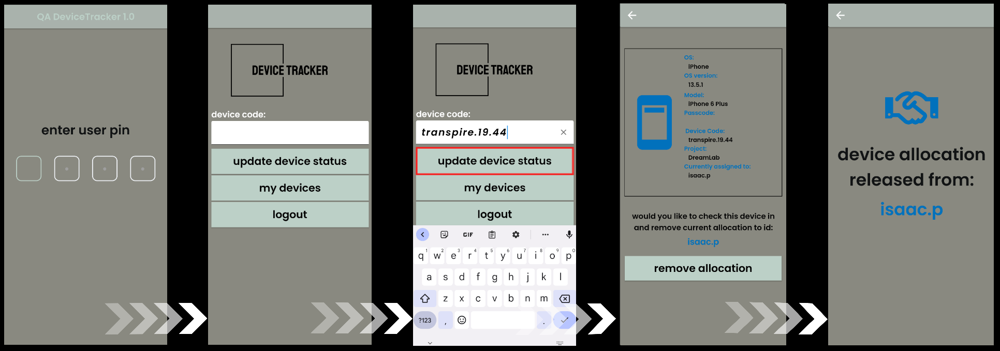
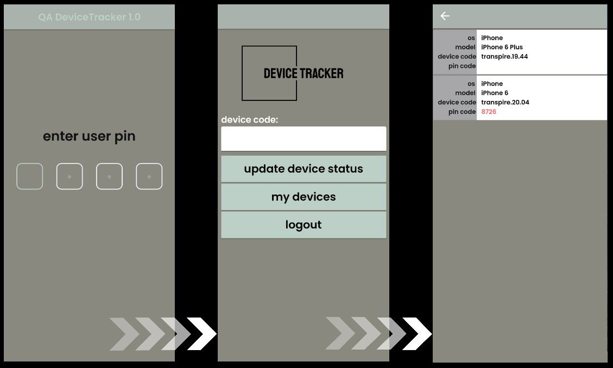

# QA Device Tracker V1.0

The purpose of this repository is to maintain a full system to enable trust-based device tracking within development teams.

<hr/>

### Table of Contents  
- [Application](#application)  
- [AWS Backend](#aws-backend)  
- [Database Structure](#database-structure)  
- [Web Application](#web-application)  
- [Utilities](#utilities)  
- [Resources](#resources)

<hr/>

## Application

This system utilizes an application built and compiled with Flutter that allows trust-based device check-in/check-out based on a unique pin attributed to a single user and housed in a Dynamo database. This pin is used to assign all actions performed within a given session to a single, authorized user. <br/>

Actions offered within the apps:
> - Check-out Device: submit an object containing the authorized users identity attribute and a device code
> - Check-in Device: Remove the 'in-use' attribute and move the current user to the status of previous user

Application flow chart:


<br/>

### Application flows
Device checkout flow
<br/> 


<br/> 

Device checkin flow
<br/> 



<br/> 

My devices - allocated devices
<br/> 



<br/> 

My devices - no allocated devices
<br/> 


<br/> 

<hr/>

## AWS Backend

The backend consists of an AWS Gateway API which routes to dedicated Lambda integrations, each of which have full access rights to a DynamoDB table set.

All routes secured, ```x-api-key``` key required.

### Gateway API routes:
| Route| operation|Integration|Table|
|-------------|:-------|:-------------|-----:|
| /getdevice| POST|GetSingleDevice|TranspireDevices|
| /getdevices| GET|GetDeviceData|TranspireDevices|
| /getuser| POST|ValidateUserPin|Users|
| /updatestatus| POST|HandleDeviceData|TranspireDevices|

TODO: architecture diagrams

<hr/>

## Database Structure

DynamoDB (NoSQL)
| Table name | Schema |
|-------------|--------:|
|TranspireDevices|
|Users|

Schemas:
> TranspireDevices
```json
{
    "transpirecode": S,
    "deviceid": S,
    "devicecode": S,
    "os": S,
    "model": S,
    "osversion": S,
    "allocationid" I,
    "allocation": S,
    "passcode": S,
    "project": S,
    "screensize": S,
    "inuse": B,
    "dateconfirmed": S
}
```

> Users
```json
{
    "pin" I,
    "Project": S
    "User": S
    "UserID": I
}
```


<hr/>

## Web Application

Web interface v1.0

Node (ejs) based web application implementing db scans via AWS-SDK 2.12.<br/>

Attributes include:
- Data presentation with [Tabulator](http://tabulator.info/) library
- Read-only access
- Filterable
<br/>


<br/>

### Setup
1. Pull repo

2. Install resources
```bash
npm install
```

3. Create dotenv config file
```yaml
DDB_REGION="[REDACTED]"
DDB_ACCESSKEY="[REDACTED]"
DDB_SECRETKEY="[REDACTED]"
API_HOST="[REDACTED]"
```

4. Run server
```bash
node .
```

<hr/>

## Utilities

> Python3 script for mass loading cleaned data via UpdateDevice API gateway route

Schema:
```json
{
    "transpirecode": S,
    "deviceid": S,
    "devicecode": S,
    "os": S,
    "model": S,
    "osversion": S,
    "allocationid": I,
    "allocation": S,
    "passcode": S,
    "project": S,
    "screensize": S,
    "inuse": B,
    "dateconfirmed": S
}
```

<hr/>

## Resources

- Palette: https://coolors.co/def2c8-c5dac1-bcd0c7-a9b2ac-898980
